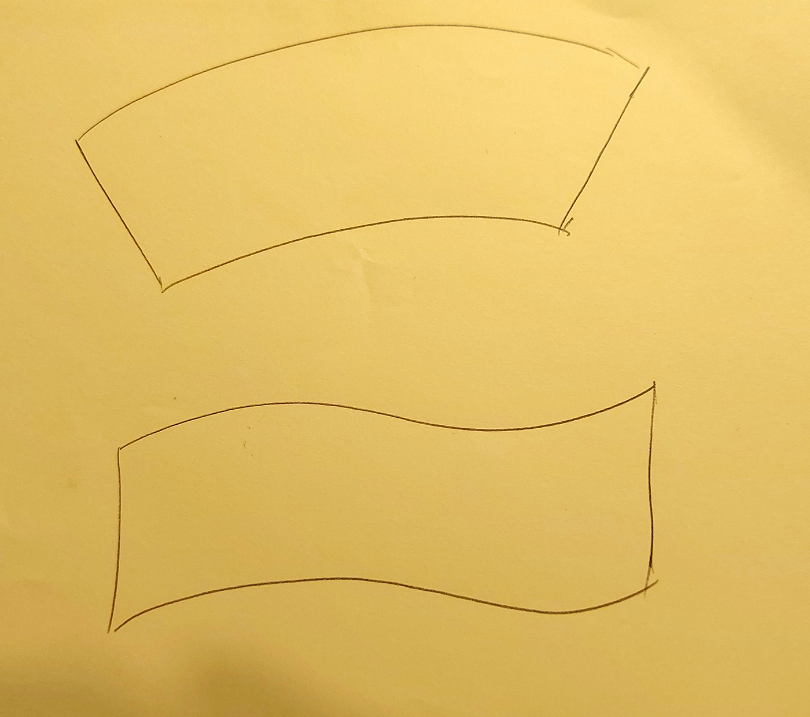

# Lettering

## Definições

Lettering: Processo manual para a obtenção de **letras únicas, a partir de desenhos**.

Tipografia: Processo **mecânico ou automatizado** para a obtenção de caracteres regulares e repetíveis
*ex: fonte digital*

<iframe width="560" height="315" src="https://www.youtube.com/embed/eFmi2BK0wFw" title="YouTube video player" frameborder="0" allow="accelerometer; autoplay; clipboard-write; encrypted-media; gyroscope; picture-in-picture" allowfullscreen></iframe>

## Referências

[Painel Lettering Pinterest](https://pin.it/45d0Yxy ':ignore')

#### Hashtags Instagram (precisa estar logado):

[#lettering](https://www.instagram.com/explore/tags/lettering/ ':ignore')

[#handlettering](https://www.instagram.com/explore/tags/handlettering/ ':ignore')

[#letteringonsunday](https://www.instagram.com/explore/tags/letteringonsunday/ ':ignore')

[#36daysoftype](https://www.instagram.com/explore/tags/36daysoftype/ ':ignore')

perfil [Letras Q flutuam](https://www.instagram.com/letrasqflutuam/ ':ignore')

 

 

## Exercício 1: Expressão Conceitual Básica

<iframe width="560" height="315" src="https://www.youtube.com/embed/N0AEjf0g9Rw" title="YouTube video player" frameborder="0" allow="accelerometer; autoplay; clipboard-write; encrypted-media; gyroscope; picture-in-picture" allowfullscreen></iframe>

1. Pensar em possibilidades da frase: "**Está me ouvindo**", focando principalmente em possíveis tons de voz;
2. Usar o modelos de letras do arquivo PDF abaixo para retraçar (se possível, imprimir)
Arquivo PDF: [Modelos de Letras](arquivos/REF-Rubik.pdf ':ignore')  (este arquivo usa a fonte [Rubik](https://fonts.google.com/specimen/Rubik), disponível no Google Fonts, mostrando apenas variações de peso);
3. Explore possibilidades livres de alinhamento, espaçamento e, principalmente, o posicionamento dentro da folha. Usar uma folha para cada solução da frase.

## Exercício 2: Expressão Conceitual Livre

1. Com a ajuda da [planilha](https://docs.google.com/spreadsheets/d/1Qei8lS7wF_hEzvCYT7wpd0U_LqqSZm1NW5mbB0w6jCU/edit?usp=sharing ':ignore') elaborada colaborativamente, selecionar qualquer um dos conceitos para desenho, analisando também o universo conceitual de palavras e conceitos incluídos por todos os participantes.

2. Planejar o desenho:
   - Selecionar uma fonte tipográfica para referência, sugestão de [Google Fonts](https://fonts.google.com/ ':ignore').
   - Para esse exercício será necessário elaborar formas para se "encaixar" o desenho da palavra. Desejável que a forma ajude a reforçar o conceito.

3. Caso seja necessário, pode-se usar um papel translúcido (papel vegetal ou manteiga) para refinar o desenho e "limpar" os traços.

4. Registrar o resultado final com uma foto para entrega.

## Exercício 3: Projeto Lettering

**Em duplas**, selecionar ou elaborar uma frase curta para desenho
> Pode ser um ditado popular uma frase

O projeto se divide em algumas etapas, que devem ser registradas para entrega:

1. **Pesquisa**
	- Universo visual gráfico e tipográfico
	- Formas tipográficas de referência que se alinham com o conceito

2. **Definição**
   - Atribuição de estilo para as palavras com maior ênfase ou mais importantes (peso e expressão)
	  - Selecionar as palavras mais importantes e atribuição conceito e estilo tipográfico
   - Definição de estilo para as palavras de "ligação"
	- Normalmente mais neutro ou mais leve
3. **Planejamento**
   - Elaborar uma dinâmica visual ANTES do desenho
   - Esboços individuais
4. **Finalização**
   - Finalização de **apenas um**: à mão ou digital (Photoshop/Illustrator)
	 - Cor, definição do traço, ajustes e refinamentos

A entrega deverá ser realizada com um único PDF com várias páginas (sugestão: elaborar no InDesign para treinar o aprendizado da disciplina de Diagramação)
- a versão do PDF deve ser "Impressão de Alta Qualidade / High Quality Print" 