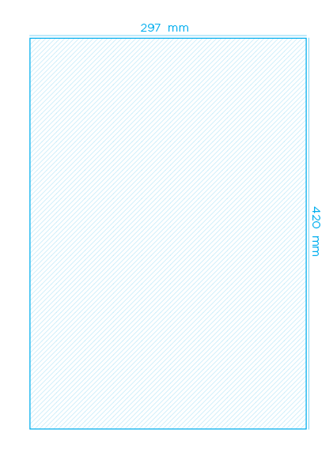

# Poster tipográfico

## Referências

[Typographic Posters](https://www.typographicposters.com/ ':ignore')

[Letterform Archive](https://letterformarchive.org ':ignore')

[Google Fonts](https://fonts.google.com/ ':ignore')

## Objetivo e informações

Criação de pôster tipográfico ```formato A3, vertical```, usando fontes disponíveis, entendendo assim a dinâmica de construção de cartaz, conceituação tipográfica, construção de paleta cromática, introdução/revisão de produção gráfica (CMYK x RGB, resolução).

Os cartazes elaborados nesse exercício devem, obrigatoriamente, dar ênfase à tipografia, que precisa expressas os conceitos definidos anteriormente à construção/planejamento.

## Exercício: Projeto de Pôster Tipográfico

**Em duplas**, escolher um trecho de música marcante e, se possível, que ambos no grupo se interessam.

Assim como o [Projeto Lettering](/lettering?id=exerc%c3%adcio-3-projeto-lettering), este exercício tem como base o desenvolvimento de um projeto, onde as etapas de pesquisa e planejamento precisam estar concluídas antes da execução/finalização.



1. **Pesquisa**

    - Levantamento visual gráfico a respeito do conceito a ser explorado ou conceito entendido da música. 
    - Sugestão de elaborar um painel no [Pinterest](https://br.pinterest.com/ ':ignore')
    - Referencial de dinâmicas do cartaz a ser explorada na solução final
    - Levantamento histórico de fontes para projeto: Identificar formas e fazer uma breve pesquisa de referências/similaridades das fontes possíveis para uso
        - Justificar a opção tipográfica 

2. **Planejamento**

    - Definição da estrutura do poster, formato A3
    - Escolha de fontes a serem usadas, representando da melhor forma o conceito levantando/percebido na etapa de pesquisa:
        - Para esse exercício, usaremos exclusivamente as fontes do [Google Fonts](https://fonts.google.com/ ':ignore') devido à qualidade e disponibilidade.
    - Definição de paleta cromática

3. **Execução e Finalização**
    
    - Preferecialmente, usar o Adobe Illustrator para finalização
    - Exportar/Salvar Como PDF usando a predefinição "Impressão de Alta Qualidade / High Quality Print"