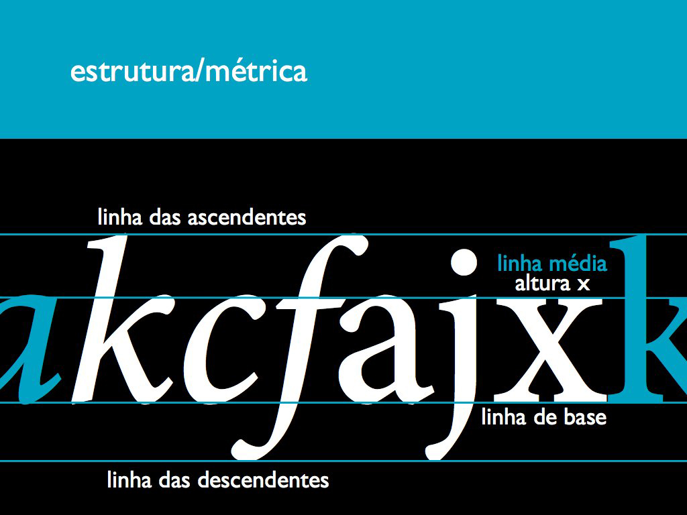
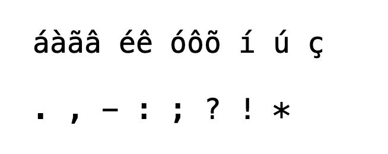
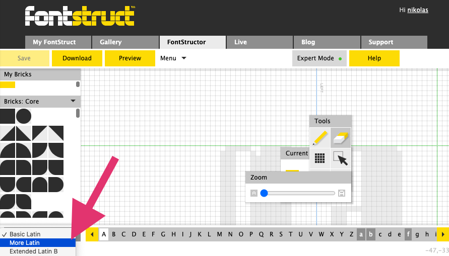

# Type Design


## Referências
Referências:

*A linguagem invisível da tipografia* - Erik Spiekermann

*Pensar com tipos* -  Ellen Lupton

[Myfonts](https://www.myfonts.com/ ':ignore')

[Typographic Posters](https://www.typographicposters.com/ ':ignore')

[Letterform Archive](https://letterformarchive.org ':ignore')

[Google Fonts](https://fonts.google.com/ ':ignore')

## Exercício: Type Design

1. Desenho de uma letra ```a``` caixa-baixa (minúscula) à mão livre
2. Reinterpretação da letra desenha em [papel quadriculado](arquivos/quadriculado.pdf ':ignore'), onde:
   - Os quadradinhos devem estar 100% preenchidos ou 100% não-preenchidos (dinâmica do pixel)
   - Alterar a forma da letra `a` original para se adaptar ao novo processo
   - Inclusão de mais quadrados gera maior "definição" principalmente para letras redondas
3. Criação de conta no site [Fontstruct](https://fontstruct.com/ ':ignore')
   - [Apresentação da interface Fontstruct](https://ca-lti.bbcollab.com/recording/772cd48573564ebcaa382c4f847a5141 ':ignore')
4. Elaboração do alfabeto completo das **apenas das caixas-baixas** com base estética alinhada ao `a` original, respeitando ou "quebrando as regras" dos alinhamentos padrão da métrica tipográfica:



5. Além dos caracteres básicos (a - z), será necessário também criar os acentuados:



Que podem ser acessados da seguinte forma an tela do Fontstruct:



6. Fazer o download do arquivo de fonte, instalar no computador e aplicar no [template](arquivos/template.ai ':ignore') para entrega.

